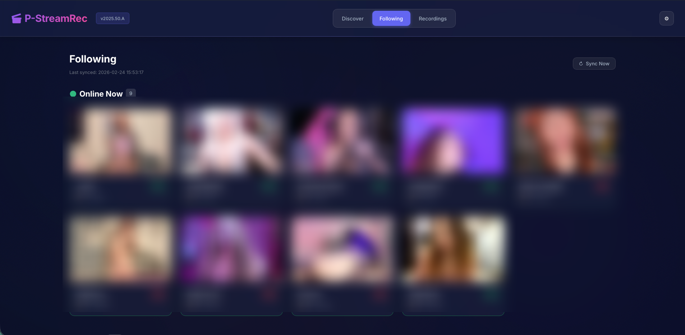
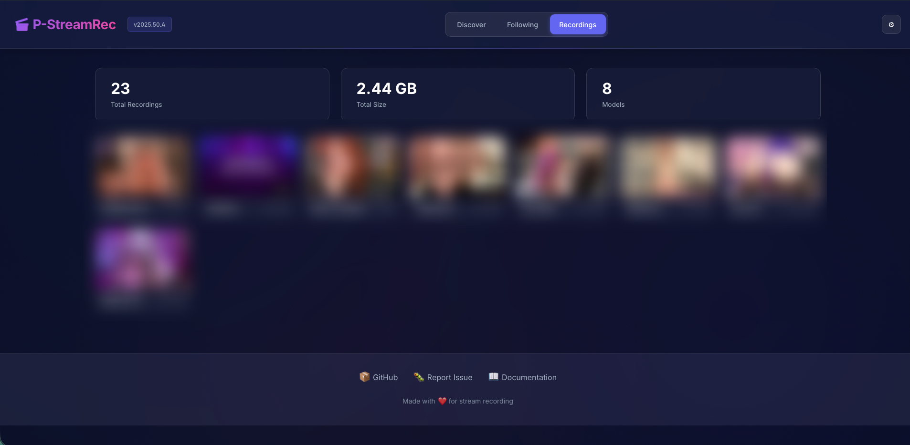

# P-StreamRec

[](LICENSE)
[](https://www.docker.com/)
[](https://github.com/raccommode/P-StreamRec)

**Watch, record, and follow live cam streams (Chaturbate, CAM4) + any m3u8 source — with a modern web interface.**

## Features

- **24/7 automatic recording** — monitors models and records when they go live
- **Recording segmentation** — optionally split captures by 30/60/90 minutes or by maximum file size
- **Auto MP4 conversion** — converts TS to compressed MP4 in background (50-70% smaller)
- **Discover** — browse live models from every supported site with gender, tag, and search filters
- **Following** — one list aggregating your follows across Chaturbate and CAM4
- **Recordings** — manage all recordings with built-in video player
- **Live Watch** — watch streams directly in the browser with HLS player
- **Account login** — username/password for Chaturbate and CAM4 (better stream quality + follow sync)
- **FlareSolverr** — automatic Cloudflare bypass via dedicated container
- **Settings** — manage accounts, FlareSolverr status, tag blacklist
- **Password protection** — optional login to secure the interface
- **GitOps updates** — update the app directly from the UI
- **Docker ready** — one command to get started

## Supported sites

| Site | Watch | Record | Follow |
|------|:-----:|:------:|:------:|
| **Chaturbate** | ✅ | ✅ | ✅ |
| **CAM4** | ✅ | ✅ | ✅ |

### Coming soon

| Site | Watch | Record | Follow |
|------|:-----:|:------:|:------:|
| Stripchat | ⏳ | ⏳ | ⏳ |
| BongaCams | ⏳ | ⏳ | ⏳ |
| MyFreeCams | ⏳ | ⏳ | ⏳ |

## Screenshots

| Discover | Following | Recordings |
|----------|-----------|------------|
|  |  |  |

## Quick Start

### UmbrelOS (one-click install)

P-StreamRec ships as an Umbrel Community App Store. On your Umbrel:

1. Open the **App Store**, click the store menu, then **Community App Stores → Add**
2. Paste the repo URL: `https://github.com/raccommode/P-StreamRec`
3. Install **P-StreamRec** from the store

FlareSolverr is bundled inside the app — no extra setup required. Recordings are stored in `${APP_DATA_DIR}/data` on your Umbrel.

### Docker Compose (recommended, includes FlareSolverr)

```yaml
version: "3.8"
services:
  flaresolverr:
    image: ghcr.io/flaresolverr/flaresolverr:latest
    environment:
      - LOG_LEVEL=info
    ports:
      - "8191:8191"
    restart: unless-stopped

  p-streamrec:
    image: ghcr.io/raccommode/p-streamrec:latest
    depends_on:
      - flaresolverr
    environment:
      - CB_RESOLVER_ENABLED=true
      - FLARESOLVERR_URL=http://flaresolverr:8191
    ports:
      - "8080:8080"
    volumes:
      - ./data:/data
    restart: unless-stopped
```

### Docker Run (simple)

```bash
docker run -d --name p-streamrec \
  -p 8080:8080 -v ./data:/data \
  -e CB_RESOLVER_ENABLED=true \
  ghcr.io/raccommode/p-streamrec:latest
```

**Access:** `http://localhost:8080`

## Configuration

| Variable | Default | Description |
|----------|---------|-------------|
| `OUTPUT_DIR` | `/data` | Recordings folder |
| `PORT` | `8080` | Web interface port |
| `FFMPEG_PATH` | `ffmpeg` | Path to FFmpeg |
| `CB_RESOLVER_ENABLED` | `true` | Enable Chaturbate support |
| `CB_REQUEST_DELAY` | `1.0` | Delay between Chaturbate requests (seconds) |
| `PASSWORD` | — | Password to protect the interface (optional) |
| `AUTO_RECORD_USERS` | — | Comma-separated usernames to auto-record |
| `RECORD_SEGMENT_DURATION_MINUTES` | `0` | Optional recording split interval: `0`, `30`, `60`, or `90` minutes |
| `RECORD_SEGMENT_SIZE_MB` | `0` | Optional maximum TS segment size in MB; `0` disables size-based splitting |
| `CHATURBATE_USERNAME` | — | Chaturbate login (optional, enables Following + better quality) |
| `CHATURBATE_PASSWORD` | — | Chaturbate password (optional) |
| `FLARESOLVERR_URL` | — | FlareSolverr URL (e.g. `http://flaresolverr:8191`) |
| `PSTREAMREC_PROXY_URL` | — | Optional outbound proxy for provider requests (`http://`, `https://`, `socks4://`, `socks5://`) |
| `HTTP_PROXY` / `HTTPS_PROXY` / `ALL_PROXY` | — | Standard proxy env vars, also honored when `PSTREAMREC_PROXY_URL` is unset |
| `NO_PROXY` | `localhost,127.0.0.1,flaresolverr` | Hosts that should bypass standard proxy env vars |
| `TZ` | `UTC` | Timezone (e.g. `America/Toronto`) |

For recording downloads, FFmpeg can use HTTP(S) proxies via `PSTREAMREC_PROXY_URL`
or the standard proxy env vars. SOCKS proxies are supported by the Python
resolvers/API calls; use an HTTP proxy if FFmpeg also needs to fetch HLS
segments through the proxy.

## Usage

1. **Add a model** — click **+**, enter a Chaturbate username or m3u8 URL
2. **Auto-record** — the system checks every 2 minutes and records when live
3. **Auto-convert** — when the stream ends, TS is converted to MP4 automatically
4. **Watch live** — click a model card to open the live player
5. **Browse replays** — go to the Recordings page to watch or delete recordings

### Recording format

- Original: `/data/records/<username>/YYYYMMDD_HHMMSS_ID.ts` (MPEG-TS, lossless)
- Segmented original: `/data/records/<username>/YYYYMMDD_HHMMSS_ID_part001.ts`, `_part002.ts`, ... when duration or size segmentation is enabled
- Converted: `/data/records/<username>/YYYYMMDD_HHMMSS_ID.mp4` (H.264, auto-generated)

### Storage estimates

| Format | Size per hour |
|--------|---------------|
| TS (original) | ~2–4 GB |
| MP4 (converted) | ~600 MB–1.2 GB |

## Development

```bash
git clone https://github.com/raccommode/P-StreamRec.git
cd P-StreamRec
python -m venv .venv && source .venv/bin/activate
pip install -r requirements.txt
uvicorn app.main:app --reload
```

**Stack:** FastAPI, SQLite (aiosqlite), HLS.js, FFmpeg, Docker

## License

**Non-Commercial Open Source License** — See [LICENSE](LICENSE)

Free to use, modify, and distribute — **no commercial use** — share modifications under same license — attribution required
